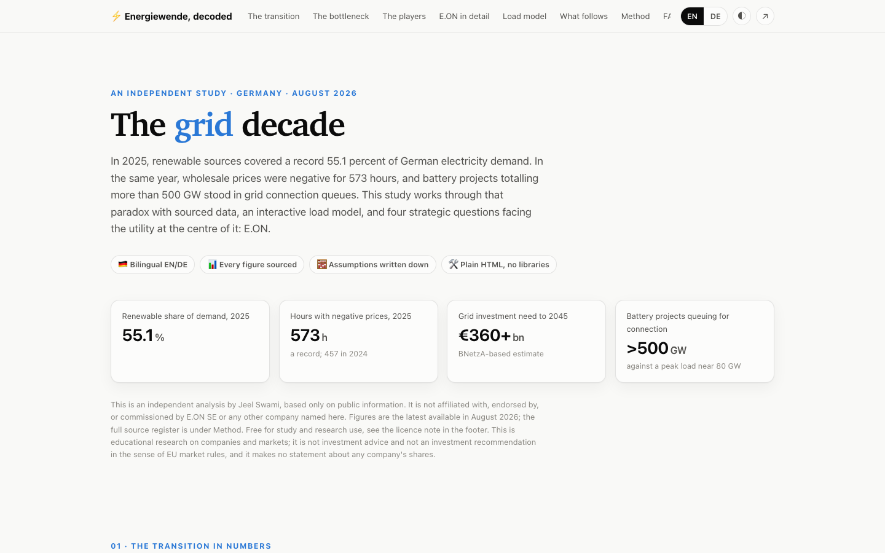

# ⚡ Energiewende, decoded

**A bilingual (EN/DE) data study of Germany's energy transition, and what it means for a grid and retail utility like E.ON.**

**Deployed at: [jeelswami.github.io/energiewende-decoded](https://jeelswami.github.io/energiewende-decoded/)**

[](https://jeelswami.github.io/energiewende-decoded/)
[](#)
[](analysis/)
[](#)
[](LICENSE)



## What this is

Germany is rebuilding its power system in real time. In 2025, renewable sources covered a record 55.1 percent of electricity demand. In the same year, wholesale prices were negative for a record 573 hours, congestion management cost 3.1 billion euros, and battery storage projects totalling **more than 500 GW**, several times the national peak load of about 80 GW, stood in grid connection queues. The bottleneck of the Energiewende has moved from generation to the grid.

I wrote this study to work through that shift the way I was trained to work through a physics problem: start from measured data, state the assumptions, compute what follows, and say honestly what the model cannot tell you. The repository holds four layers:

1. **An interactive study** ([`docs/`](docs/)): hand-written SVG charts, a grid load model with a documented model card, a research FAQ, and a complete English and German language toggle. Plain HTML, CSS and JavaScript; no frameworks, no build step. Keyboard navigation, a table view for every chart, and a colour system checked for colour vision deficiency in both light and dark mode.
2. **Compiled datasets** ([`data/`](data/)): every number traced to its source, with a data dictionary that also records where sources disagree.
3. **A reproducible analysis layer** ([`analysis/`](analysis/)): pandas and matplotlib code that derives the statistics quoted in the study, among them the finding that reaching the 80 percent target for 2030 requires double the historical pace, and a correlation of r = 0.82 between installed solar capacity and hours of negative prices.
4. **A written case study** ([`CASE_STUDY.md`](CASE_STUDY.md)): market context, a close look at E.ON, and four strategy questions with quantified answers.

> **Independence note.** This is a personal analysis based only on public information. It is not affiliated with, endorsed by, or commissioned by E.ON SE or any other company mentioned. All trademarks belong to their owners; names are used only to identify the companies, and no logos or brand assets appear anywhere in this work. It is educational research, not investment advice and not an investment recommendation.

## Why E.ON as the case

After the asset swap with RWE, completed in 2020, E.ON became Europe's largest distribution system operator and energy retailer, with no large-scale generation of its own. That makes it the purest available case for the two questions this study cares about: who finances and builds the grid (E.ON plans 48 billion euros of investment from 2026 to 2030, inside a new regulatory framework and behind a connection queue of hundreds of gigawatts), and what retail becomes when dynamic tariffs, smart meters and §14a flexibility turn households into active parts of the system. Where the German energy transition succeeds or stalls, it does so first on E.ON's balance sheet.

## Using this work

The study, the compiled datasets and the code are free to use for **study, teaching and research** with attribution to Jeel Swami and a link to this repository. **Commercial use requires my written permission** (please [open an issue](https://github.com/JeelSwami/energiewende-decoded/issues) to ask). The primary data remains the property of its original publishers, which are credited in [`data/README.md`](data/README.md) and in the study's source register; if you republish that data, credit them, not me. Details in [LICENSE](LICENSE).

## Repository structure

```
energiewende-decoded/
├── docs/               The interactive study (GitHub Pages)
│   ├── index.html        structure; all copy renders from content.js (EN/DE)
│   ├── styles.css        design system: validated palette, light and dark mode
│   ├── app.js            hand-written SVG chart engine and load model
│   └── content.js        bilingual copy and every dataset, with sources
├── data/               CSV datasets and the data dictionary
├── analysis/           pandas and matplotlib: derived statistics and figures
├── CASE_STUDY.md       the written study
└── LICENSE             CC BY-NC 4.0, with a data ownership note
```

## Reproducing the analysis

```bash
cd analysis
pip install -r requirements.txt
python energiewende_analysis.py
```

The script prints the derived statistics and writes the figures to `analysis/figures/`.

## Acknowledgements

This study stands on the public work of the institutions that measure Germany's energy system: the Bundesnetzagentur and its SMARD platform, Fraunhofer ISE and the Energy-Charts team, Agora Energiewende, BDEW, the Bundesverband Wärmepumpe, the Kraftfahrt-Bundesamt, the FfE in Munich, AGEE-Stat at the BMWK, the Umweltbundesamt, and KfW Research together with PwC. The load model's coefficients rest on work by Consentec, the ZVEI, and the dissertation of A. Probst at the University of Stuttgart. Company information comes from E.ON SE investor relations, envelio, Eurelectric and CyrusOne; sector studies from Roland Berger, BCG and McKinsey; and where primary documents were unavailable, the reporting of Clean Energy Wire, pv magazine, ESS News and ZfK filled the gaps. Any errors of compilation or interpretation are mine alone.

## About the author

I am a physicist working in data science, on my way into the energy field. My research background is in computational and experimental condensed matter physics, where I studied the electronic and magnetic properties of correlated perovskite materials, followed by postdoctoral research on materials for energy science. Since then my work has moved to the intersection of physics, data and AI, training and evaluating models for scientific reasoning. On GitHub you will also find a [machine learning pipeline for semiconductor band gaps](https://github.com/JeelSwami/Materials-Band-Gap-Prediction-ML-), a [dashboard of EU research funding in North Rhine-Westphalia](https://github.com/JeelSwami/nrw-funding-dashboard), and [the vocabulary trainer I built on the way to German C1](https://github.com/JeelSwami/wortschatz-trainer).

📫 jeel.swami@outlook.com · GitHub [@JeelSwami](https://github.com/JeelSwami)
